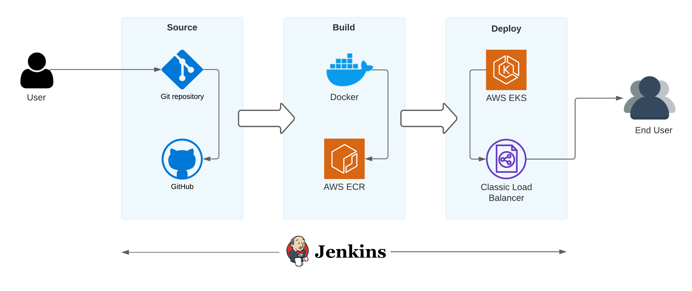

# SmallCase Assigment

## Overview

This repo contains required resources to create and deploy Flask app on AWS EKS using Jenkins pipelines.

## High Level Diagram
<p></p>

## Structure
Below is the current structure overview.
```sh
.
├── Dockerfile
├── README.md
├── app.py
├── deploy.yaml
├── image
│   └── SmallCase.png
├── requirements.txt
├── script
│   └── jenkins.sh
└── templates
    └── index.html
```
## The jenkins.sh script

This is the main pipeline script which is used to build and deploy the application.


```sh
#!/bin/bash

echo Logging in to Amazon ECR... 
$(aws ecr get-login --region us-east-1 --no-include-email) # Get ECR login
REPOSITORY_URI=<your ecr repository URI>  # ECR repo url
echo Build started on `date`
echo Building the Docker image...
docker build -t $REPOSITORY_URI .  # Build Docker image
docker tag $REPOSITORY_URI:latest $REPOSITORY_URI:latest  # Tag Docker image
echo Build completed on `date`
echo Pushing the Docker images...
docker push $REPOSITORY_URI:latest  # Push Docker image
echo Deploying the Docker image on EKS...
sudo kubectl apply -f deploy.yaml # Deploy application on EKS
echo Updating current deployment...
sudo kubectl rollout restart deployment/flask # Restart deployment
echo Deploying done on EKS... 
kubectl get service/flask-service |  awk {'print $1" " $2 " " $4 " " $5'} | column -t # Print AWS Load Balancer URL
```

## Usage

To build or update this application. User have to follow the following steps.
1. Clone the repo `git clone https://github.com/praveenraghav01/smallcase.git`
2. Create a new branch from master branch `git checkout -b <branch name>`
3. Add your changes. `git add .`
3. Commit your changes. `git commit -m "commit message"`
4. Push your changes. `git push`
5. Create a merge request.
 
One your Merge Request is accepted. jenkins will automatically build and deploy new changes.

## Steps followed

To make the above CI/CD pipeline one needs to follow the following steps.
1. Install Jenkins
2. Create pipeline
3. Add Github webhooks
4. Create ECR repository
5. Create EKS cluster

### Install Jenkins
1. Login to AWS account and choose the desire region.
2. Go to EC2 dashboard and click Launch Instance.
3. Select Amazon Linux AMI, paste the below script in user data and create a new instance.
    ```sh
    #!/bin/bash
    yum -y update
    yum install java-1.8.0
    yum remove java-1.7.0-openjdk
    wget -O /etc/yum.repos.d/jenkins.repo http://pkg.jenkins-ci.org/redhat/jenkins.repo
    rpm --import http://pkg.jenkins-ci.org/redhat/jenkins-ci.org.key
    yum install jenkins
    service jenkins start
    chkconfig --add jenkins
    ```

### Create pipeline

1. Login to Jenkins using `http://{ec2-public-dns}:8080`
2. Click New Iteam.
3. Choose Freestyle project and enter the pipeline name. Eg. SmallCase
4. In `General` select GitHub project and enter github repository url. `General > GitHub project > Project url`
5. In `Source Code Management` select Git and enter Repositories url and select credentials. If credentials not present then click Add. `Source Code Management > Git > Repositories`
6. In `Build Triggers` select `GitHub hook trigger for GITScm polling`.
7. In `Build` select `Execute shell` and paste the `jenkins.sh` script.
8. Click save.

### Add Github webhooks
1. Login to Github.
2. Create a new repository or select one from the existing repository.
3. Select `Settings` tab.
4. Click webhooks.
5. Add webhook and enter the following details.  
   a. Payload URL: `http://<jenkins-url>/github-webhook/`  
   b. Content type: `application/json`  
   c. Which events would you like to trigger this webhook?: `Just the push event`  
6. Create webhook.

### Create ECR repository
1. Login to AWS account and choose the desire region.
2. Go to ECR dashboard and click create repository.
3. Enter Repository name. 
4. Click Create repository.

### Create EKS cluster
1. Login to AWS account and choose the desire region.
2. Go to EKS dashboard and click create cluster.
3. Enter the required details.
4. Click Create Cluster.

